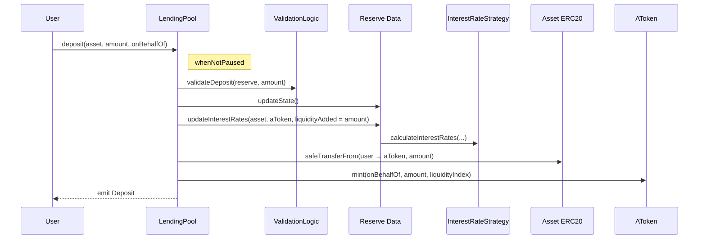
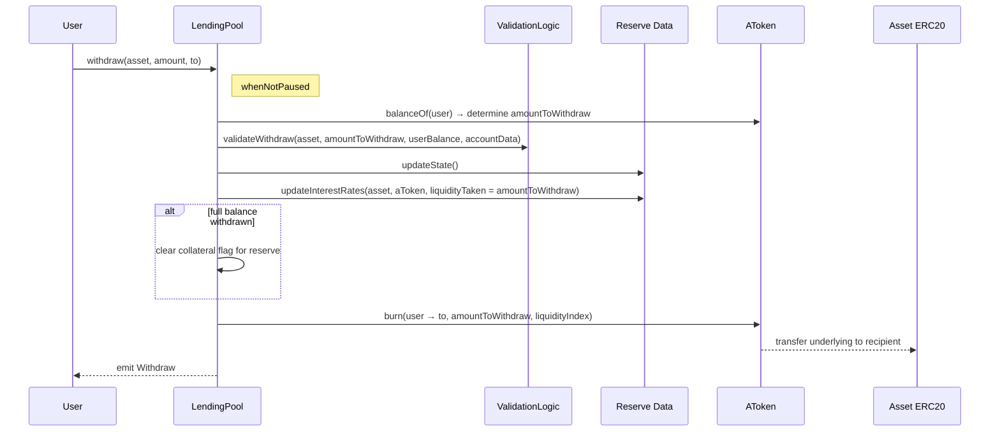
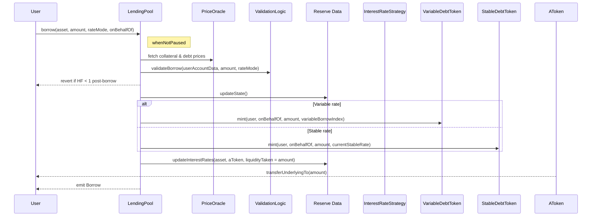
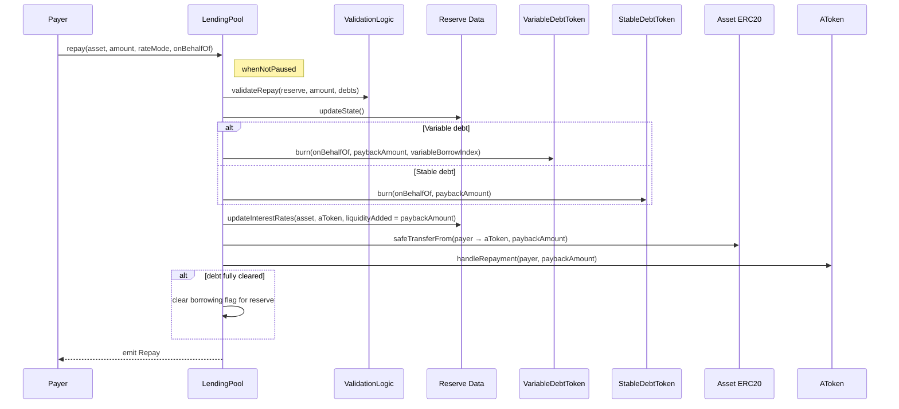
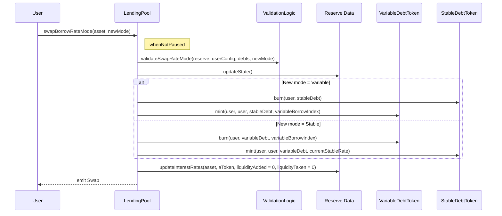
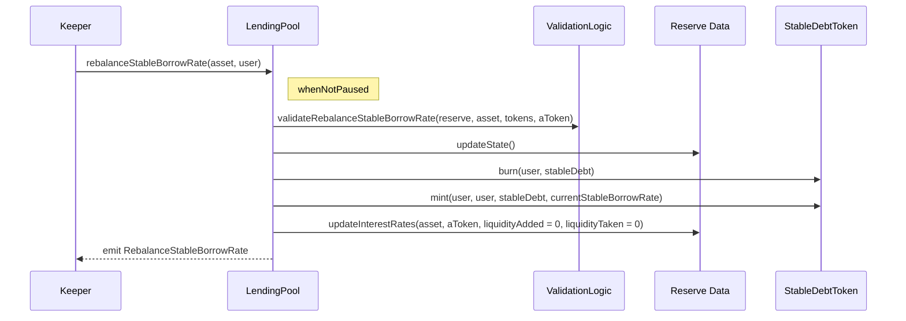
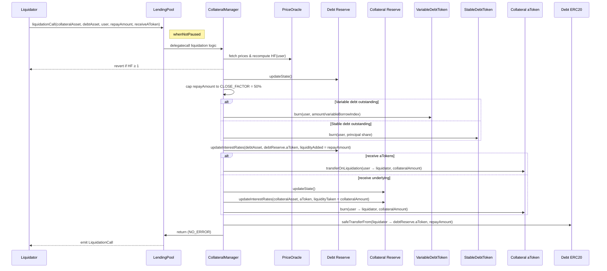

# Operational Flows

## Context
This section captures the runtime sequences of the most common Aave v2 operations. Each Mermaid diagram mirrors the order of validations, state updates, and token movements in `LendingPool.sol` and its collateral manager.

## Deposit → aToken Mint
`LendingPool.deposit` (guarded by `whenNotPaused`) accrues reserve indexes before minting aTokens so depositor shares remain proportional.

## Withdraw → aToken Burn
`LendingPool.withdraw` burns aTokens, validates post-withdraw health, and sends underlying to the recipient (`whenNotPaused`).

## Borrow → Debt Accounting
`LendingPool.borrow` validates the borrower’s health factor, mints stable or variable debt, updates indexes, and releases underlying from the reserve (`whenNotPaused`).

## Repay → Debt Burn
`LendingPool.repay` burns stable or variable debt, increases reserve liquidity, and clears borrowing flags when balances reach zero (`whenNotPaused`).

## Rate Mode Swap
`LendingPool.swapBorrowRateMode` switches a position between stable and variable debt without changing principal (`whenNotPaused`).

## Stable Rate Rebalance
`LendingPool.rebalanceStableBorrowRate` forces high-utilisation stable loans to the current stable rate to protect deposit yields (`whenNotPaused`).

## Liquidation Trigger & Settlement
`LendingPool.liquidationCall` delegates to `LendingPoolCollateralManager`, which enforces the 50% close factor and manages collateral transfers (`whenNotPaused`).

## Notes
- Every flow calls `reserve.updateState()` before token mint/burn to keep scaled balances accurate.
- `setPoolPause(true)` blocks all entry points; freezing a reserve stops new supply/borrow but still allows repayments and liquidations.
- Flash-loan adapters (Uniswap/ParaSwap helpers) interact with these flows by acting as flash-loan receivers, repaying principal plus premium within the same transaction.
