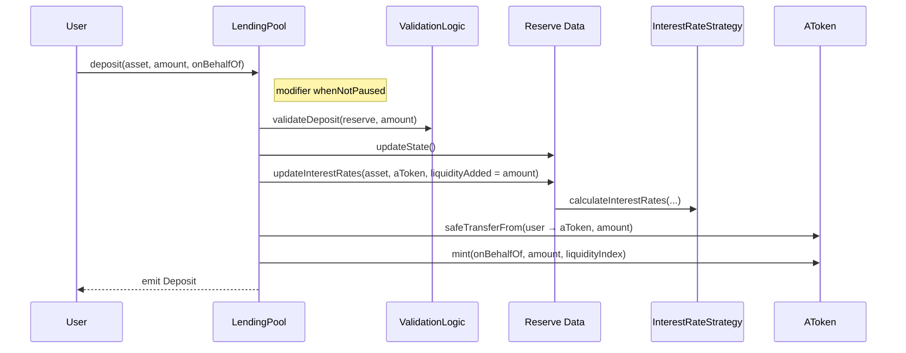
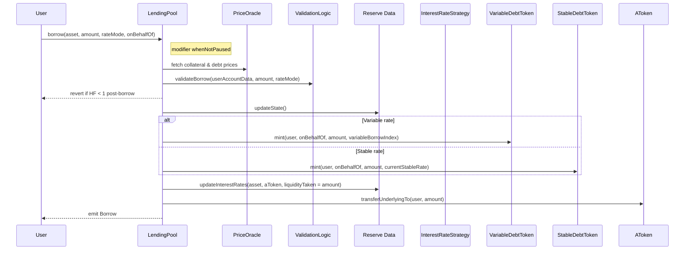
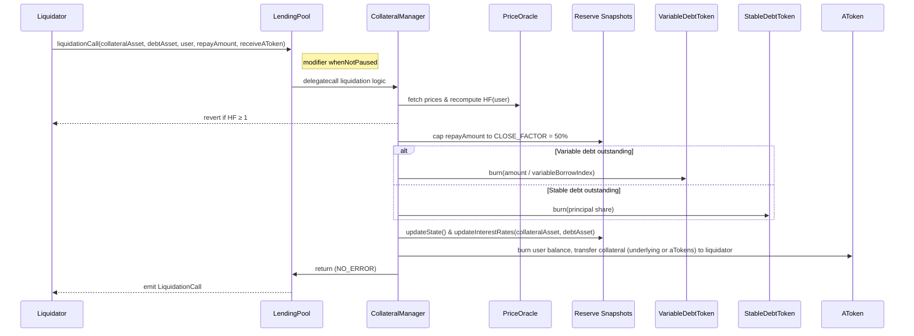

# Operational Flows

## Context
This section walks through the critical end-to-end flows on Aave v2. The diagrams focus on validation order, index updates, and token mint/burn operations as implemented in `LendingPool.sol` and `LendingPoolCollateralManager.sol`.

## Deposit → aToken Mint
`LendingPool.deposit` is guarded by `whenNotPaused`. The pool accrues interest before minting to keep depositor shares consistent.

## Borrow → Debt Accounting
`LendingPool.borrow` (also `whenNotPaused`) validates the post-borrow health factor, then mints the appropriate debt token, updates rates, and releases liquidity from the reserve’s aToken.

## Liquidation Trigger & Settlement
`LendingPool.liquidationCall` carries a `whenNotPaused` modifier and delegates to `LendingPoolCollateralManager` via `delegatecall`. The manager enforces the fixed 50% close factor, burns the correct debt tokens, and transfers collateral with the liquidation bonus applied.

## Notes
- Each flow calls `reserve.updateState()` before minting or burning tokens so scaled balances reflect accrued interest.
- `setPoolPause(true)` blocks these entry points entirely. Freezing a reserve prevents new deposits/borrows but still allows repayments and liquidations.
- Flash-loan adapters (e.g., Uniswap/ParaSwap helpers) plug into the same flows by acting as flash-loan receivers; they must settle the flash debt plus premium within the transaction.
